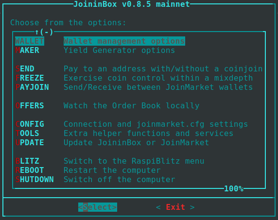

# JoininBox Menu Guide

**⚠️ Work in Progress** – This documentation is currently under active development. Content may be incomplete, inaccurate, or subject to change. Contributions and feedback are welcome!

**📅 Last Updated:** March 2026

> *JoininBox Terminal Menu – Navigate JoinMarket features with a simple graphical interface*

---

## How to use this documentation?

This guide explains what each menu option in JoininBox does. **Use this documentation to understand each option before running it live with real Bitcoin.**

If you already have JoinMarket and JoininBox installed (e.g., on RaspiBlitz), use this walkthrough to understand the available features.

For detailed explanations of every menu option, see the [👉 **Clickable Menu Walkthrough**](joininbox/joininbox-menu-docu.md).

---

## What is JoininBox?

JoininBox is a terminal-based graphical menu for JoinMarket. It simplifies navigation and configuration without requiring command-line knowledge.

---

## What is JoinMarket?

JoinMarket is a Bitcoin privacy protocol that uses CoinJoins to break the link between sender and receiver.

**Key Concepts:**

- **CoinJoin** – Mix your Bitcoin with others to obscure transaction trails
- **Mixdepths** – 5 separate "pockets" for better privacy
- **Maker/Taker** – Earn fees (Maker) or spend privately (Taker)

---

## Community & Support

**Community**

- [Telegram](https://t.me/joinmarketorg)

**GitHub:**

- [JoininBox](https://github.com/openoms/joininbox)
- [JoinMarket](https://github.com/JoinMarket-Org/joinmarket-clientserver/)
- [JoinMarket-NG](https://github.com/joinmarket-ng/joinmarket-ng)
- [RaspiBlitz](https://github.com/raspiblitz/raspiblitz)

---

## Security Notice

JoininBox is designed for security-focused use. Keep these basics in mind:

- Keep your seed phrase offline and secure
- Use Tor for all network connections
- Regularly update your software

---